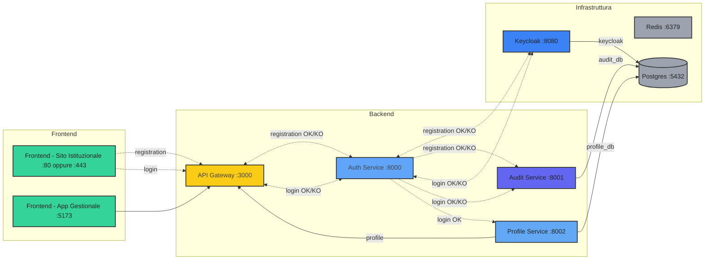

# Ports

## Services

| Name                 | Lablel               | Porta | Descrizione                           |
| -------------------- | -------------------- | ----- | ------------------------------------- |
| Keycloak             | Keycloak             | 8080  | Identity provider                     |
| Postgres             | Postgres             | 5432  | Relational database                   |
| www                  | Sito web             | 5172  | Sito web                              |
| app                  | React App            | 5173  | Applicazione React                    |
| api-gateway          | API Gateway          | 3000  | Entrypoint API                        |
| flow-manager         | Process Service      | 3001  | Servizio di processo                  |
| auth-service         | Auth Service         | 8000  | Servizio di autenticazione            |
| audit-service        | Audit Service        | 8001  | Servizio di audit                     |
| profile-service      | Profile Service      | 8002  | Servizio di profilazione              |
| notification-service | Notification Service | 8003  | Servizio di invio notifiche           |
| subscription-service | Subscription Service | 8004  | Servizio di sottoscizione abbonamento |
| tenant-service       | Tenant Service       | 8005  | Servizio di gestione tenant           |
| contact-service      | Contact Service      | 8006  | Servizio di gestione contatti         |
| import-service       | Import Service       | 8007  | Servizio di gestione importazioni     |
| template-service		 | Template Service     | 8008  | Servizio di gestione template         |

```sh

```

| template-service | Template Service | 8008 | Servizio di gestione template |
| billing-service | Billing Service | 8009 | Servizio di fatturazione |
| calendar-service | Calendar Service | 8010 | Servizio di gestione calendario |
| document-service | Document Service | 8011 | Servizio di gestione documenti |
| invoice-service | Invoice Service | 8012 | Servizio di gestione fatture |
| matter-service | Matter Service | 8013 | Servizio di gestione pratiche |
| report-service | Report Service | 8014 | Servizio di gestione report |
| search-service | Search Service | 8015 | Servizio di gestione ricerca |
| social-media-manager | Social Media Manager | 8016 | Servizio di gestione social media |
| storage-service | Storage Service | 8017 | Servizio di gestione storage |

## Databases

| Service      | Database        |
| ------------ | --------------- |
| keycloak     | keycloak_db     |
| postgres     | postgres        |
| audit        | audit_db        |
| auth         | auth_db         |
| profile      | profile_db      |
| notification | notification_db |
| subscription | subscription_db |
| tenant       | tenant_db       |
| contact      | contact_db      |

| billing | billing_db |
| template | template_db |
| calendar | calendar_db |
| document | document_db |
| invoice | invoice_db |
| matter | matter_db |
| report | report_db |
| search | search_db |
| social-media | social_media_db |
| storage | storage_db |

## Diagram


