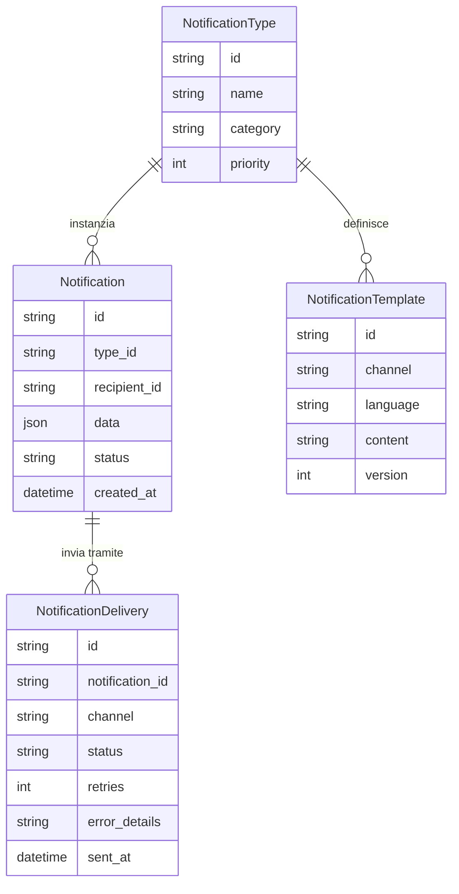
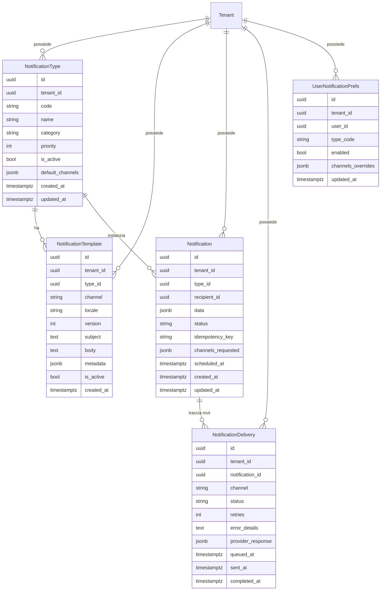

# Notificaion Service

## In pratica

NotificationType = la regola.

NotificationTemplate = la forma.

Notification = il messaggio specifico per un utente.

NotificationDelivery = il tracking di ogni invio.

## Modello concettuale

