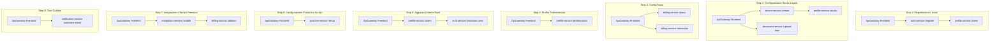

# Onboarding General

## Flusso richieste nei servizi

```mermaid
flowchart TD

    subgraph Step1[Step 1: Registrazione / Invito]
        UI1[ApiGateway Frontend] --> AUTH1[auth-service /register]
        AUTH1 --> PROFILE1[profile-service /users]
    end

    subgraph Step2[Step 2: Configurazione Studio Legale]
        UI2[ApiGateway Frontend] --> TENANT1[tenant-service /create]
        TENANT1 --> PROFILE2[profile-service /studio]
        UI2 --> DOC1[document-service /upload-logo]
    end

    subgraph Step3[Step 3: Scelta Piano]
        UI3[ApiGateway Frontend] --> BILL1[billing-service /plans]
        UI3 --> BILL2[billing-service /subscribe]
    end

    subgraph Step4[Step 4: Profilo Professionista]
        UI4[ApiGateway Frontend] --> PROFILE3[profile-service /professionist]
    end

    subgraph Step5[Step 5: Aggiunta Utenti e Ruoli]
        UI5[ApiGateway Frontend] --> PROFILE4[profile-service /users]
        PROFILE4 --> AUTH2[auth-service /provision-user]
    end

    subgraph Step6[Step 6: Configurazione Pratiche e Archivi]
        UI6[ApiGateway Frontend] --> PRACT1[practice-service /setup]
    end

    subgraph Step7[Step 7: Integrazioni e Servizi Premium]
        UI7[ApiGateway Frontend] --> INTEG1[integration-service /enable]
        INTEG1 --> BILL3[billing-service /addons]
    end

    subgraph Step8[Step 8: Tour Guidato]
        UI8[ApiGateway Frontend] --> NOTIF1[notification-service /welcome-email]
    end
```