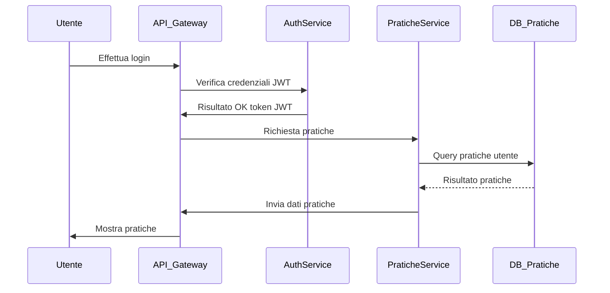

# User Flow

## Overview

```mermaid
sequenceDiagram
    participant Utente
    participant API_Gateway
    participant AuthService
    participant PraticheService
    participant DB_Pratiche

    Utente->>API_Gateway: Effettua login
    API_Gateway->>AuthService: Verifica credenziali JWT
    AuthService->>API_Gateway: Risultato OK token JWT
    API_Gateway->>PraticheService: Richiesta pratiche
    PraticheService->>DB_Pratiche: Query pratiche utente
    DB_Pratiche-->>PraticheService: Risultato pratiche
    PraticheService->>API_Gateway: Invia dati pratiche
    API_Gateway->>Utente: Mostra pratiche
```
