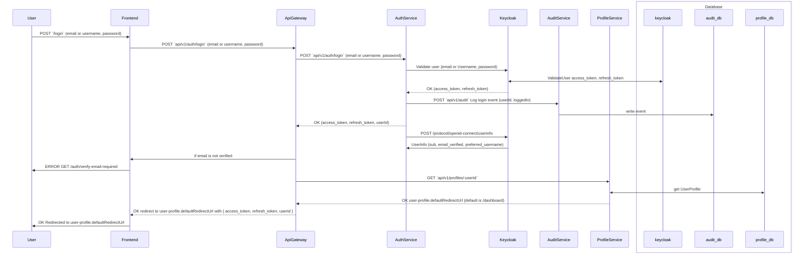
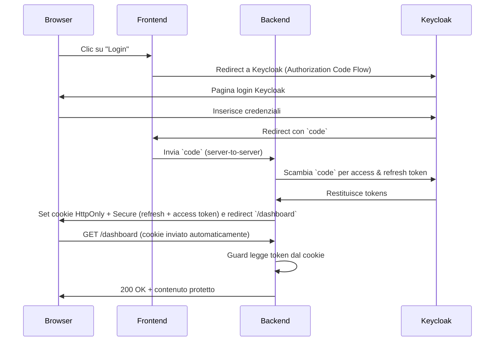

# User Authentication

L'utente si è registrato, quindi dovrà autenticarsi e se l'autenticazione ha successo atterrare sulla sua pagina di profilo.

Allo scopo interpelleremo api-gateway che farà il sio lavoro restituendo l'esito dell'autenticazione.

Api-gateway ha un suo indirizzo che l'app trova nelle variabili d'ambiente come API_GATEWAY_BASE_URL e sarà qualcosa tipo `http://localhost/3000/api`.

Ho bisogno delle indicazioni per esporre le rotte e la logica di autenticazione.

Se l'autenticazione ha successo, allora sarà un'altro servizio ad inizializzare il profilo dell'utente, nello specifico sarà profile-service che verrà coinvolto da auth-service se keycloak resituisce esito positivo all'autenticazione.

## Diagram

# Se non hai una sessione o JWT da cui recuperare l’utente, allora devi cambiare approccio, perché non puoi affidarti ai dati del client come fossero “veri” (possono essere falsificati).

In pratica ci sono tre strade sicure:

1️⃣ Usare un token “pubblico” di richiesta reinvio
Quando invii l’email di verifica la prima volta, potresti includere un Request Token univoco e a scadenza, separato dal verificationLink.

Esempio:

Utente si registra → backend crea requestToken (UUID, scade in 15 min).

Questo token viene salvato a DB associato all’utente.

Quando l’utente apre la pagina “Verifica email necessaria”, il backend glielo passa nel template Nunjucks (perché è meno sensibile del verificationLink vero e proprio).

Il client lo usa nel fetch() per richiedere il reinvio.

Il server controlla che il token sia valido e legato a un utente, poi genera un nuovo verificationLink e invia l’email.

2️⃣ Passare username ma firmato
Puoi passare username dal backend al client, ma non in chiaro:

Lo firmi con HMAC o JWT lato server (con scadenza breve, tipo 5-10 min).

Quando il client chiede il reinvio, ti manda indietro il token firmato.

Il backend verifica la firma e lo decodifica per sapere l’username.

Così eviti spoofing del nome utente.

3️⃣ Usare un link di reinvio email univoco
Puoi proprio evitare fetch() e fare un link tipo:

arduino
Copy
Edit
https://tuosito.it/resend-verification?token=abcd1234
token è un UUID temporaneo salvato a DB.

Cliccando, il backend lo valida e reinvia la mail.

Poi scade.

Questo è super semplice e non espone username.

💡 Nota:
Il problema principale senza JWT/sessione è che il server deve sempre avere un modo di verificare che la richiesta sia legittima. Quindi serve comunque un qualche token firmato o generato lato server, anche se non è una sessione classica.

You said:
la terza solizione non mi sembra robusta, cosa succede infatti se l'utente perde la mail con il primo link di verifica?

ChatGPT said:
Esatto, la terza soluzione (link di reinvio univoco nella prima email) funziona bene solo se l’utente ha ancora quell’email.

Se la perde:

Non ha il link di reinvio.

Non può richiedere un nuovo token.

È bloccato finché non apre un canale alternativo (supporto manuale).

Per questo, se vuoi che l’utente possa sempre richiedere un nuovo invio senza dipendere dalla prima email, serve un meccanismo che gli permetta di farlo in sicurezza, anche senza sessione JWT.

💡 Soluzione robusta senza JWT
Io userei una via di mezzo tra la 1 e la 2:

Pagina pubblica /verify-email?req=XYZ dove req è un token di richiesta reinvio (UUID + firma HMAC).

Questo token è generato dal server alla registrazione e salvato a DB.

È a lunga scadenza (es. 24 ore) e può essere rigenerato se l’utente lo perde.

Il token non è il verificationLink, quindi anche se qualcuno lo intercetta può solo chiedere il reinvio (non confermare l’account).

L’utente arriva sulla pagina → il template Nunjucks prende req dall’URL e lo include nel JS del pulsante “Invia di nuovo”.

Il server, quando riceve /api/resend-verification con req,

Valida la firma.

Recupera l’utente dal DB.

Genera un nuovo verificationLink valido pochi minuti.

Lo invia via email.

Puoi permettere che req venga rigenerato se l’utente si registra di nuovo o contatta il supporto.

📌 Vantaggi

Robusto: anche se l’utente perde la prima email, può usare un link statico inviato da altre vie (anche SMS o supporto).

Sicuro: il token req serve solo per chiedere un reinvio, non per verificare l’account.

Scadenza gestibile: puoi anche renderlo “multi-uso” per un tempo limitato.

Se vuoi, ti posso scrivere un diagramma mermaid del flusso così visualizzi come funziona questo approccio.
Vuoi che lo faccia?

You said:
rispega meglio la soluzione 1 + 2
quale parte è presa da 1 e quale da 2

ChatGPT said:
Ok, ricostruiamo bene la soluzione 1 + 2 combinata e ti spiego cosa prendo da ciascuna.

🔹 Da Soluzione 1 (token pubblico di richiesta reinvio)
L’idea di base: invece di passare direttamente username o verificationLink, il backend genera un token dedicato al reinvio.

Questo token è salvato nel DB insieme all’utente.

Il token è usa e getta o con scadenza breve (es. 15–30 min) e può essere rigenerato infinite volte.

Il client, quando vuole il reinvio, invia solo questo token → il server lo valida e rigenera un verificationLink.

📌 Cosa tengo dalla Soluzione 1:

Uso un token “neutro” per identificare la richiesta di reinvio, invece di passare dati sensibili.

🔹 Da Soluzione 2 (firma del dato)
In Soluzione 2 si firmava username o altri dati così il server potesse verificare che non fossero stati modificati dal client.

Nel mix, prendo l’idea di firmare il token stesso per evitare che qualcuno possa inventarselo.

Esempio:

Genero UUID → lo firmo con HMAC segreto → ottengo signedToken.

Salvo a DB UUID + username + scadenza.

Invio al client solo signedToken.

Quando il client fa POST /api/resend-verification, il server:

Verifica la firma HMAC.

Cerca il token nel DB.

Se valido → genera e invia nuova email di verifica.

📌 Cosa tengo dalla Soluzione 2:

Firmo il token per evitare spoofing e garantire integrità.

🔹 Flusso finale combinato
Registrazione utente

Creo UUID (token reinvio)

Firmo con HMAC → signedToken

Salvo UUID, username, scadenza nel DB.

Invio l’email di verifica normale e passo signedToken alla pagina "Verifica email necessaria".

Pagina verify-email.njk

Mostra username (opzionale, preso lato server).

Pulsante “Invia di nuovo” → invia signedToken al backend.

Endpoint /api/resend-verification

Verifica la firma di signedToken.

Trova l’utente associato.

Genera nuovo verificationLink (valido pochi minuti).

Invia email.

Aggiorna o rinnova signedToken se serve.

📌 Vantaggi di questo mix

Non esponi il verificationLink (Soluzione 1).

Non ti affidi a username in chiaro (Soluzione 2).

Token firmato → niente spoofing.

Token corto → facile da passare in HTML o query string.

Può essere rigenerato senza che l’utente debba conservare la prima email.

Se vuoi, ti faccio subito un esempio reale di codice NestJS + Nunjucks con questo sistema, così vedi come generare e verificare il token.
Vuoi che lo prepari?

You said:
quindi per ottenre il signedToken mi serve sempre lo username

ChatGPT said:
Esatto ✅
per generare il signedToken serve comunque sapere a chi appartiene, e quindi sì, devi avere lo username (o l’userId).

La logica è così:

Come nasce il signedToken
Al momento della registrazione (o quando l’utente richiede un reinvio in un contesto sicuro, tipo login)

Recuperi userId o username.

Generi un UUID casuale (requestId), ad esempio "7c54b9aa-2c63-4f90-a8f0-1f3a5f5022fd".

Salvi a DB:

nginx
Copy
Edit
requestId → userId → expiresAt
Crei un signedToken firmando requestId con HMAC segreto.

Esempio di firma:

ini
Copy
Edit
signedToken = base64(requestId + "." + HMAC_SHA256(requestId, secret))
Perché non metto lo username nel token
Lo username non serve nel token se hai requestId salvato a DB con l’associazione a quell’utente.

In questo modo il client non conosce dati personali (neanche username), ma solo un identificatore “neutro” firmato.

Flusso sicuro
Backend genera signedToken partendo dal requestId.

Nunjucks lo inserisce nella pagina HTML.

Il client lo manda nel fetch() → /api/resend-verification.

Il backend:

Verifica la firma.

Recupera requestId dal DB.

Trova l’utente (userId o username).

Genera nuovo verificationLink.

Invia email.

💡 Così lo username ti serve solo lato server quando crei il requestId la prima volta, ma non va mai nel token né nel DOM.
