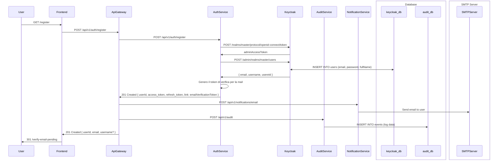

# User Registration

## Description

L'utente si registra nel sistema.

Fornisce `email`, `username` e `password`, il sistema controlla che non ci siano doppiani su Keycloak e in caso non ve ne siano salva l'utenza sul db di Keycloak.

Restituisce `access_token` e `refresh_token` associati all'utente e il relativo `userId`.

L'utente viene creato con email da verificare.

Viene a questo punto coinvolto il `servizio di notifiche` dall'`ApiGateway` il quale invierà la mail di verifica all'utente.

Il token di verifica viene generato dal `servizio di autenticazione`.

## Diagram Registration

