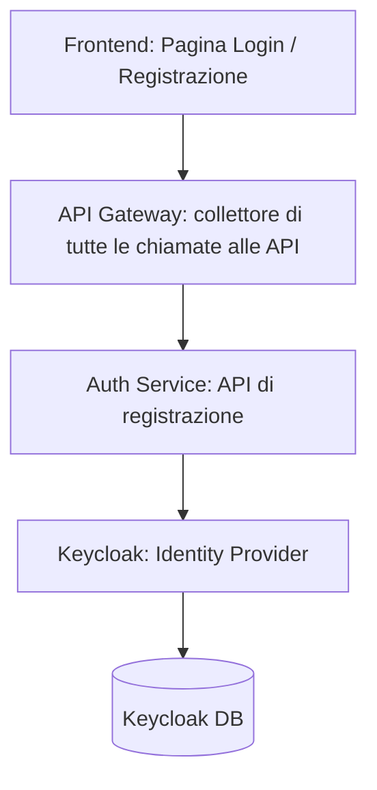

# User Registration

## Diagram

```mermaid
graph TD
    Frontend[Frontend: Pagina Login / Registrazione]
    APIGateway[API Gateway: collettore di tutte le chiamate alle API]
    AuthService[Auth Service: API di registrazione]
    Keycloak[Keycloak: Identity Provider]
    KeycloakDB[(Keycloak DB)]

    Frontend --> APIGateway
    APIGateway --> AuthService
    AuthService --> Keycloak
    Keycloak --> KeycloakDB
```
