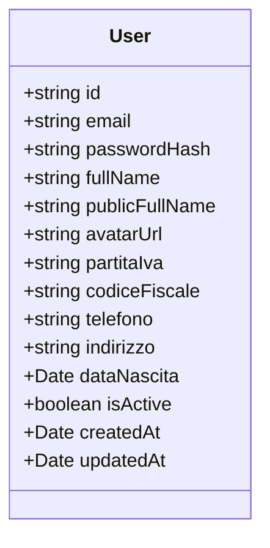
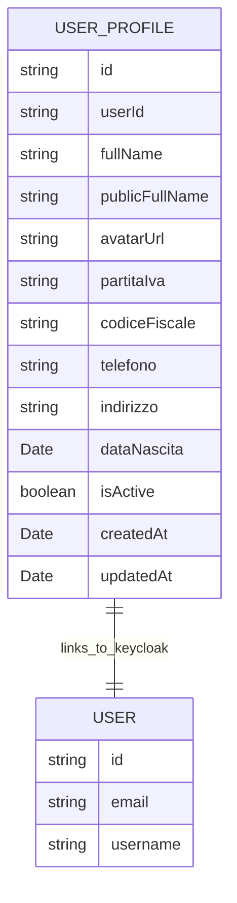

# User

## Diagram



## Spiegazione rapida dei campi

- id: UUID o ID interno.
- email + passwordHash: autenticazione.
- fullName / publicFullName: nome completo interno e quello pubblico.
- avatarUrl: link all'immagine avatar.
- partitaIva, codiceFiscale, telefono, indirizzo, dataNascita: dati anagrafici completi.
- isActive: se l'account è attivo o sospeso.
- createdAt, updatedAt: gestione timestamp.

Le info dell'utente non andranno su keycloak,ma su un db dedicato.

Keycloak serve per gestire l'autenticazione e autorizzazione:

- login
- password
- ruoli
- permessi
- gruppi
- gestione account base

Tutti gli altri dati "business" dell'utente (tipo partita IVA, avatar, indirizzo, telefono, ecc.) non vanno salvati su Keycloak ma in un tuo database (es. PostgreSQL, MongoDB, quello che usi).

### Schema concettuale

```plaintext
Keycloak
├── id utente
├── email
├── username
├── password
├── ruoli / permessi
└── altri metadata di autenticazione (pochissimi)

Tuo Database
├── id utente (collegato a quello di Keycloak)
├── avatarUrl
├── partitaIva
├── codiceFiscale
├── indirizzo
├── telefono
├── ecc...
```



Qui `userId` in `USER_PROFILE` è la chiave esportata che punta all'id Keycloak.
